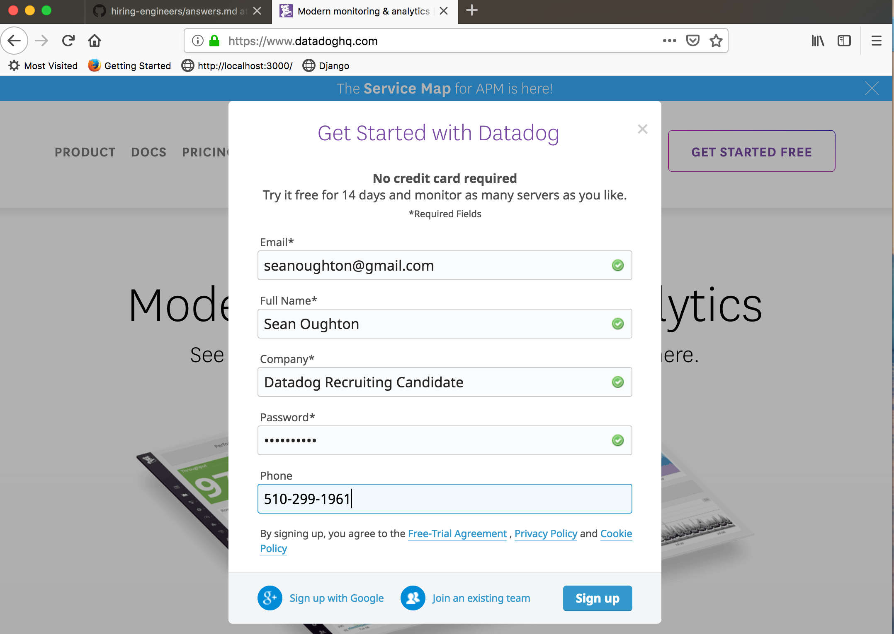

### Links

1) Link to [host-dashboard](https://app.datadoghq.com/dash/host/732018690?live=true&page=0&tile_size=m&is_auto=false&from_ts=1544806380000&to_ts=1544809980000)

2) Link to [mySQL-integration](https://app.datadoghq.com/dash/integration/12/mysql---overview?tile_size=m&page=0&is_auto=false&from_ts=1544806500000&to_ts=1544810100000&live=true)

3) Link to [Host-Map](https://app.datadoghq.com/infrastructure/map?fillby=avg%3Acpuutilization&sizeby=avg%3Anometric&groupby=availability-zone&nameby=name&nometrichosts=false&tvMode=false&nogrouphosts=true&palette=green_to_orange&paletteflip=false&node_type=host)

4) Link to [My Monitors](https://app.datadoghq.com/monitors/manage)

5) Link to [Datadog-Docs](https://docs.datadoghq.com/)

* All Screenshots are inline with the answers to the questions.

### Section 1: Prerequisites - Setup the environment
  1) Spin up a Linux Virtual Machine using Vagrant and Virtual Box
  2) Sign up for Datadog
   
  3) Install the Agent on VM and get it reporting metrics

### Section 2: Collecting Metrics

### Section 3: Visualizing Data

### Section 4: Monitoring Data

### Section 5: Collecting APM Data

### Section 6: Creative Use for Datadog Question
