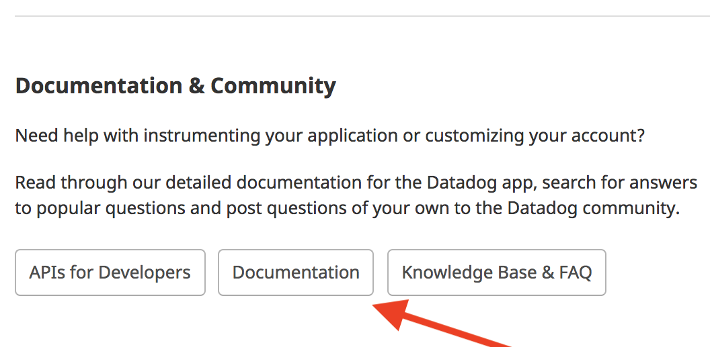
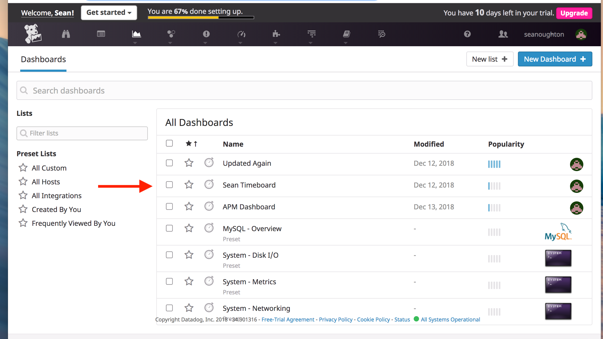

## Links

1. Link to [host-dashboard](https://app.datadoghq.com/dash/host/732018690?live=true&page=0&tile_size=m&is_auto=false&from_ts=1544806380000&to_ts=1544809980000)

2. Link to [mySQL-integration](https://app.datadoghq.com/dash/integration/12/mysql---overview?tile_size=m&page=0&is_auto=false&from_ts=1544806500000&to_ts=1544810100000&live=true)

3. Link to [Host-Map](https://app.datadoghq.com/infrastructure/map?fillby=avg%3Acpuutilization&sizeby=avg%3Anometric&groupby=availability-zone&nameby=name&nometrichosts=false&tvMode=false&nogrouphosts=true&palette=green_to_orange&paletteflip=false&node_type=host)

4. Link to [My Monitors](https://app.datadoghq.com/monitors/manage)

5. Link to [Datadog-Docs](https://docs.datadoghq.com/)

*** All Screenshots are inline with the answers to the questions. ***

## Section 1: Prerequisites - Setup the environment
1. Spin up a Linux Virtual Machine using Vagrant and Virtual Box

   - Install VirtualBox
     - Link to [Install-VirtualBox](https://www.virtualbox.org/wiki/Downloads)
     - 

   - Install Vagrant
     - Link to [Install-Vagrant](https://www.vagrantup.com/intro/getting-started/install.html)

     - After Installing Vagrant, you create a Vagrant file in the directory where you want to create your VM. You do this with the following command:  `$ vagrant init ubuntu/xenial64` .
    This clones the appropriate box, in my case an Ubuntu Linux 16.04 box.
     - Once the Vagrant file has been created properly, you can spin up your VM with the command: `vagrant up`
     - After the VM has spun up, you can enter the machine with the command: `vagrant ssh`
     - You now have access to the VM through the command line and can navigate around, install software and create and execute files.

2. Sign up for Datadog
   - Signing up for Datadog is super easy. Here is a screenshot of the form.
   - 

3. Install the Agent on your VM and get it reporting metrics
   - To install the Datadog Agent on your VM
     - Datadog makes this really easy by giving you a link to the instructions in the Getting Started Dropdown Menu
     - There is a link there for Install an Agent
       - Link to [Install-Agent](https://app.datadoghq.com/account/settings#agent)
     - Here is a screenshot of the Installation Instructions:
       - 
     - Here you choose your OS, mine is Ubuntu.
     - After choosing your OS, you are given clear and easy instructions on how to install the Datadog Agent through your command line
     - Here is a screenshot of the instructions
       - 
     - After running this in the command line of your VM, you should get two confirmations that the agent installed.
       - In the command line you should see something like this:
         - 
       - In the DataDog Web Portal you should see something like this:
         - 
     - Finally, in the DataDog Web Portal you should see that you have a host sending data and your first metrics
       - 
       - 

## Section 2: Collecting Metrics
1. Add tags in the Agent config file
   - To add tags to the Agent config file, you can get instructions from the DataDog Documentation
   - You can get to the Docs by clicking on the question mark on the homepage and selecting Resources from the dropdown menu
   - On the Resources page select Documentation and this will take you to the Documentation Page

     - 
   - On the Documentation Page, Click on Tagging and then Assigning Tags
     - 
   - Here is a Link to those Docs: [DataDog-Tag-Docs](https://docs.datadoghq.com/tagging/assigning_tags/?tab=go)
   - In order to add tags, you have to edit the datadog.yaml file which is located on your VM in the conf.d directory. The path on Linux is: /etc/datadog-agent/datadog.yaml
   - In the datadog.yaml file, you add tags as key value pairs, an example would be `tags: <KEY_1>:<VALUE_1>, <KEY_2>:<VALUE_2>, <KEY_3>:<VALUE_3>`
   - Here is a screenshot of how to add the tags in the datadog.yaml file.
   - 

   - You can see the tags in the DataDog web portal in the Host Map Page which you can get to either through the Infrastructure menu by selecting Host Map or by clicking on Expanded Host map
   - Here is a screenshot of that:

   - 
   -
   - Here is a screenshot of my host and it's tags on the Host Map page
   - 

2. Install a database and Datadog Integration
   - Intalling a Database on a Vagrant VM is can be done in many ways. I used this set of instructions for installing mySQL on Linux.
     - Link to [Install-Database](https://www.digitalocean.com/community/tutorials/how-to-install-mysql-on-ubuntu-16-04)
   - After the database is installed, you can install the Datadog integration by following the instructions in the web portal
   - You can either use the link in the Get started drop down or click on the puzzle icon and select Integrations from the drop down. Here is a screenshot of that:
   - 

   - Select an integration from the choices. I chose MySQL
   - Datadog provides easy to follow instructions on how to set up the integration. Here are Screenshots of how to do that:
   - 
   - 
   - 

   - After you have created a datadog user for your MySQL server, and granted the appropriate privileges, you configure the agent to connect to your database server in the mysql.yaml file located at conf.d/mysql.yaml.
   - Restart the agent and run the info command to make sure that the integration checks passed.
   - If everything is working properly, you should see this in the Datadog web portal
    - 

3. Create a custom Agent check which submits a metric named my_metric
   - To create a custom Agent check, there is a set of instructions in the DataDog docs under Developer Tools
   - Here is a screenshot of that:
   - 
   - Custom agent checks are best for collecting metrics from custom apps.
   - In order to create a custom check we must create two files:
     - a .yaml file located `etc/datadog-agent/conf.d` directory
     - and a .py file located `etc/datadog-agent/checks.d` directory
     - These files names MUST MATCH (`my_check.yaml`, `my_check.py` for example) or the process will not work.
     - The yaml file contains at a minimum a sequence called instances, that contains at least one mapping. An example would be: `instances: [{}]`
     - The python file for the check must inherit from the AgentCheck Class
     - Every custom check class needs a check method, inside of which we can use any of the built-in DogStatd methods. For this example, I am using the gauge method
     - Here is a screenshot of the two files I created:
     - 
     - 
     - After you create these two files, you must restart the datadog agent for them to start sending metrics. You can then run the agent info request  and see if our check is running:
     - Here is a screenshot of that:
     - 
4. Bonus: Can you change the collection interval without modifying the Python check file?
   - Yes. You can modify the collection interval in the .yaml file as shown above.

## Section 3: Visualizing Data
1. Utilize the Datadog API to create a Timeboard.
   - In order to use the DataDog API to create a Timeboard, you must create a script that will send a POST request to the API
   - The instructions for how to do this can be found if you navigate to the Datadog help page, and then click `API's for Developers`. This has documentation on how to use the API. If you click on Timeboards, you can get the code to create a script that will use the API to Create, Update and Delete Timeboards.
   - Here is a screenshot of that page:

   - 

   - I created a Python script, that imported the Datadog api module for making API calls.
   - Here is a screenshot of that script.
   - 

   - In order to run the script, you need both an API key and an Application key.
   - You can find both of those keys under the Integration Menu if you select
   API's.
   - 

   - Here you can generate both API and Application Keys:
   - 

   - Once you have these keys, you can copy and paste them into your script and then run the script to create a timeboard based on the variables in the script.
   - To specify specific metrics that you want on the timeboard, you use the requests variable, with key value pairs representing the request query and the type of metric you want on the board.
   - For this challenge, I needed to create a timeboard that has my custom metric scoped over my host, any metric from the Integration on my Database with the anomaly function applied, and my custom metric with the rollup function applied to sum up all the points for the past hour into one bucket.
   - Therefore, I used the following JSON in the script:
   - 

   - After running this script, the timeboard is created and you have access to it through the Datadog web portal UI.
   - You can find it in your Dashboard List.
   - 
   - 
   - 

   - I Set the Timeboard's timeframe to the last 5 minutes and took a snapshot of this graph and used the @ notation to send it to myself.
   - Here is a screenshot of that:
   - 

   - Bonus Question: What is the Anomaly graph displaying?
     - The Anomaly graph identifies strange behavior in a single metric based on the metric’s past performance. The algorithms it can use are: basic, agile, robust and adaptive
     - Here is a link to more information about it:
     - - Link to [Anomaly Graph](https://www.datadoghq.com/blog/introducing-anomaly-detection-datadog/)

## Section 4: Monitoring Data

## Section 5: Collecting APM Data

## Section 6: Creative Use for Datadog Question
