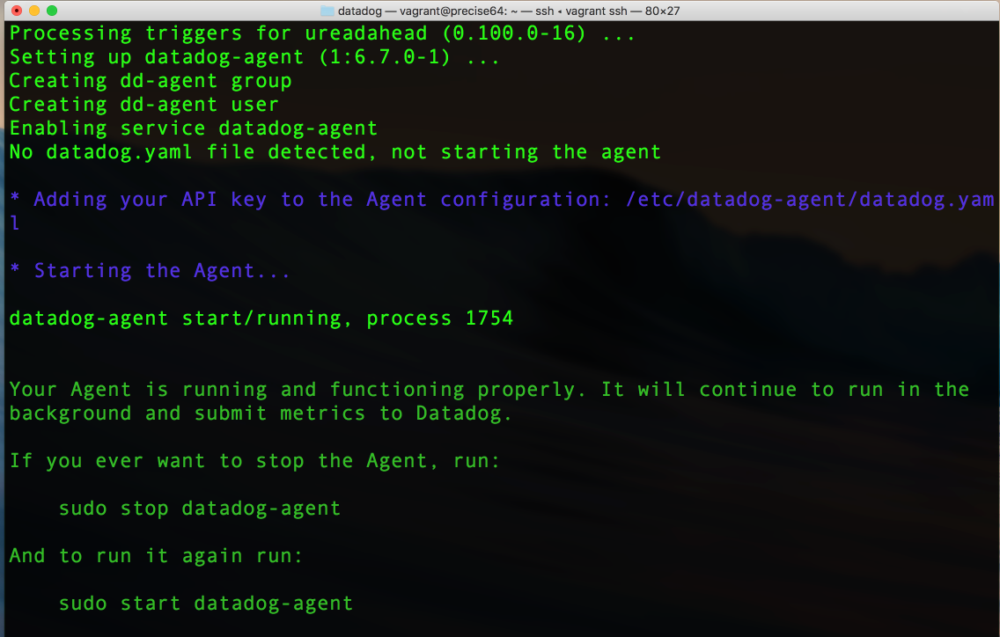
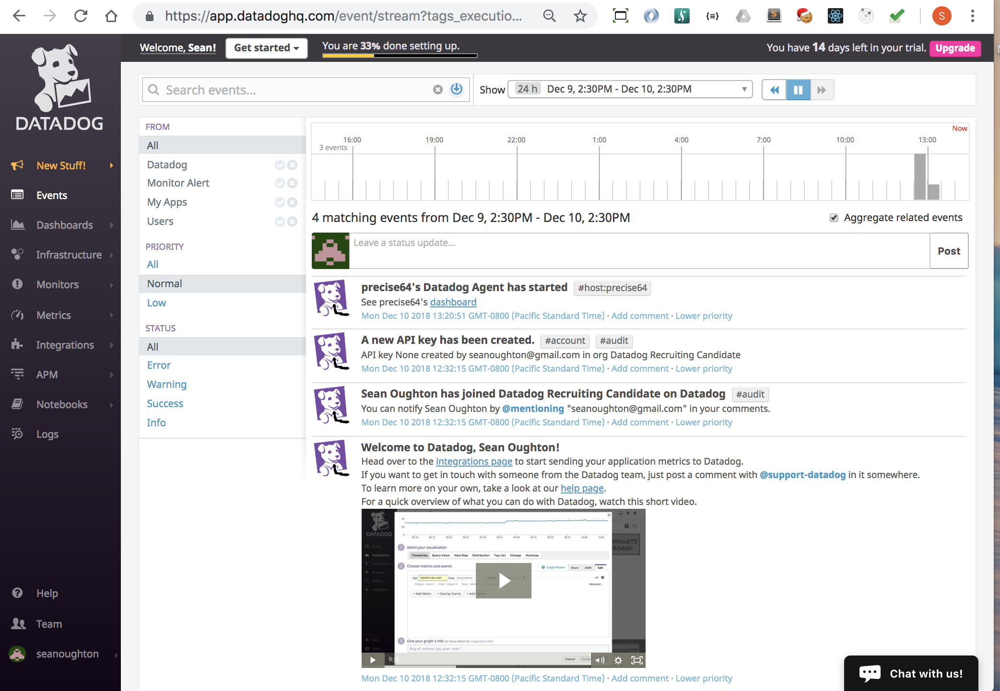

## Links

1. Link to [host-dashboard](https://app.datadoghq.com/dash/host/732018690?live=true&page=0&tile_size=m&is_auto=false&from_ts=1544806380000&to_ts=1544809980000)

2. Link to [mySQL-integration](https://app.datadoghq.com/dash/integration/12/mysql---overview?tile_size=m&page=0&is_auto=false&from_ts=1544806500000&to_ts=1544810100000&live=true)

3. Link to [Host-Map](https://app.datadoghq.com/infrastructure/map?fillby=avg%3Acpuutilization&sizeby=avg%3Anometric&groupby=availability-zone&nameby=name&nometrichosts=false&tvMode=false&nogrouphosts=true&palette=green_to_orange&paletteflip=false&node_type=host)

4. Link to [My Monitors](https://app.datadoghq.com/monitors/manage)

5. Link to [Datadog-Docs](https://docs.datadoghq.com/)

*** All Screenshots are inline with the answers to the questions. ***

## Section 1: Prerequisites - Setup the environment
1. Spin up a Linux Virtual Machine using Vagrant and Virtual Box

   - Install VirtualBox
     - Link to [Install-VirtualBox](https://www.virtualbox.org/wiki/Downloads)
     - 

   - Install Vagrant
     - Link to [Install-Vagrant](https://www.vagrantup.com/intro/getting-started/install.html)

     - After Installing Vagrant, you create a Vagrant file in the directory where you want to create your VM. You do this with the following command:  `$ vagrant init ubuntu/xenial64` .
    This clones the appropriate box, in my case an Ubuntu Linux 16.04 box.
     - Once the Vagrant file has been created properly, you can spin up your VM with the command: `vagrant up`
     - After the VM has spun up, you can enter the machine with the command: `vagrant ssh`
     - You now have access to the VM through the command line and can navigate around, install software and create and execute files.

2. Sign up for Datadog
   - Signing up for Datadog is super easy. Here is a screenshot of the form.
   - 

3. Install the Agent on your VM and get it reporting metrics
   - To install the Datadog Agent on your VM
     - Datadog makes this really easy by giving you a link to the instructions in the Getting Started Dropdown Menu
     - There is a link there for Install an Agent
       - Link to [Install-Agent](https://app.datadoghq.com/account/settings#agent)
     - Here is a screenshot of the Installation Instructions:
       - 
     - Here you choose your OS, mine is Ubuntu.
     - After choosing your OS, you are given clear and easy instructions on how to install the Datadog Agent through your command line
     - Here is a screenshot of the instructions
       - 
     - After running this in the command line of your VM, you should get two confirmations that the agent installed.
       - In the command line you should see something like this:
         - 
       - In the DataDog Web Portal you should see something like this:
         - 
     - Finally, in the DataDog Web Portal you should see that you have a host sending data and your first metrics
       - 
       - 

## Section 2: Collecting Metrics
1. Add tags in the Agent config file
   - To add tags to the Agent config file, you can get instructions from the DataDog Documentation
   - You can get to the Docs by clicking on the question mark on the homepage and selecting Resources from the dropdown menu
   - On the Resources page select Documentation and this will take you to the Documentation Page

     - 
   - On the Documentation Page, Click on Tagging and then Assigning Tags
     - 
   - Here is a Link to those Docs: [DataDog-Tag-Docs](https://docs.datadoghq.com/tagging/assigning_tags/?tab=go)
   - In order to add tags, you have to edit the datadog.yaml file which is located on your VM in the conf.d directory. The path on Linux is: /etc/datadog-agent/datadog.yaml
   - In the datadog.yaml file, you add tags as key value pairs, an example would be `tags: <KEY_1>:<VALUE_1>, <KEY_2>:<VALUE_2>, <KEY_3>:<VALUE_3>`
   - Here is a screenshot of how to add the tags in the datadog.yaml file.
   - 

   - You can see the tags in the DataDog web portal in the Host Map Page which you can get to either through the Infrastructure menu by selecting Host Map or by clicking on Expanded Host map
   - Here is a screenshot of that:

   - 
   -
   - Here is a screenshot of my host and it's tags on the Host Map page
   - 
   
2. Install a database and Datadog Integration
3. Create a custom Agent check which submits a metric named my_metric
   - submits metric with random value between 0 and 1000
   - change collection interval to submit once every 45 seconds
4. Bonus: Can you change the collection interval without modifying the Python check file?

## Section 3: Visualizing Data

## Section 4: Monitoring Data

## Section 5: Collecting APM Data

## Section 6: Creative Use for Datadog Question
